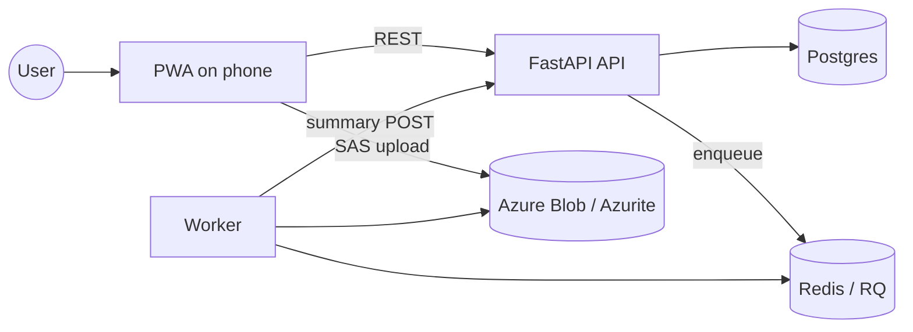

# Architecture Overview

This repo implements a phone-as-sensor PWA that captures clips, uploads event media, and processes them via a backend + worker pipeline. Local dev uses Postgres, Redis, and Azurite.

## System Context (Current MVP)



## Container View (Local Dev)

```mermaid
flowchart TD
  subgraph Device
    PWA[PWA (React + TS)]
  end

  subgraph Backend
    API[FastAPI app]
    DB[(Postgres)]
    SAS[Azurite SAS helper]
  end

  subgraph Worker
    RQ[Worker (RQ)]
    Tasks[Inference tasks]
  end

  subgraph Infra
    Redis[(Redis)]
    Azurite[(Azurite Blob)]
  end

  PWA -->|REST| API
  PWA -->|SAS upload| Azurite
  API --> DB
  API -->|enqueue| Redis
  RQ --> Redis
  RQ --> Tasks
  RQ -->|results| API
  Tasks --> Azurite
```

## Key Runtime Responsibilities

- PWA: capture media, trigger events, create clips, upload, and poll for results.
- API: sessions/events, upload URL issuance, status persistence, and summaries.
- Worker: (stub now) read jobs, perform inference, write summaries back.
- Infra: Postgres for state, Redis for queue, Azurite for local blob emulation.

## Planned Extensions (Not Implemented Yet)

- Telegram notifications and WebSocket updates.
- Production queue adapter (Azure Service Bus).
- GPU inference integration.
