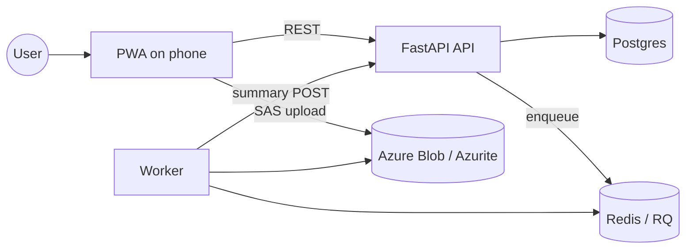

# Architecture Overview

This repo implements a phone-as-sensor PWA that captures clips, uploads event media, and processes them via a backend + worker pipeline. Local dev uses Postgres, Redis, and Azurite; several test flows run against isolated SQLite databases instead of the shared Postgres dev instance.

## System Context (Current MVP)

```mermaid
flowchart LR
  user((User))
  pwa[PWA on phone]
  api[FastAPI API]
  db[(Postgres)]
  blob[(Azure Blob / Azurite)]
  queue[(Redis / RQ)]
  worker[Worker]

  user --> pwa
  pwa -->|REST| api
  api --> db
  pwa -->|SAS upload| blob
  api -->|enqueue| queue
  worker --> queue
  worker -->|summary POST| api
  worker --> blob
```

## Container View (Local Dev)

```mermaid
flowchart TD
  subgraph Device
    PWA[PWA (React + TS)]
  end

  subgraph Backend
    API[FastAPI app]
    DB[(Postgres)]
    SAS[Azurite SAS helper]
  end

  subgraph Worker
    RQ[Worker (RQ)]
    Tasks[Inference tasks]
  end

  subgraph Infra
    Redis[(Redis)]
    Azurite[(Azurite Blob)]
  end

  PWA -->|REST| API
  PWA -->|SAS upload| Azurite
  API --> DB
  API -->|enqueue| Redis
  RQ --> Redis
  RQ --> Tasks
  RQ -->|results| API
  Tasks --> Azurite
```

## Key Runtime Responsibilities

- PWA: capture media, trigger events, create clips, upload, and poll for results.
- API: auth, ownership checks, sessions/events, upload URL issuance, notification/linking APIs, and status persistence.
- Worker: read jobs, perform inference, write summaries back, and record notification attempts/fanout outcomes.
- Infra: Postgres for state, Redis for queue, Azurite for local blob emulation.

## Shipped Notification And Access Capabilities

- Telegram device linking is implemented with a one-time token flow.
- Per-device multi-recipient subscriptions are implemented.
- Invite/share access is implemented so additional recipients can subscribe safely.
- Recipient-only browser mode is implemented for shared recipients.
- Webhook delivery is supported as an optional outbound notification target.

## Planned Extensions (Still Not Implemented)

- Production queue adapter (Azure Service Bus).
- GPU inference integration.
- Observability dashboards/alerts, deploy rollback automation, and performance/SLO validation are tracked in `PLAN.md`.
