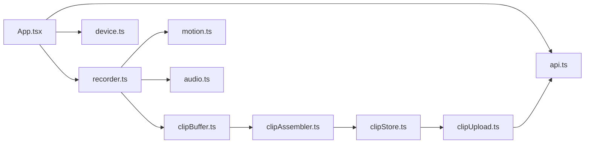
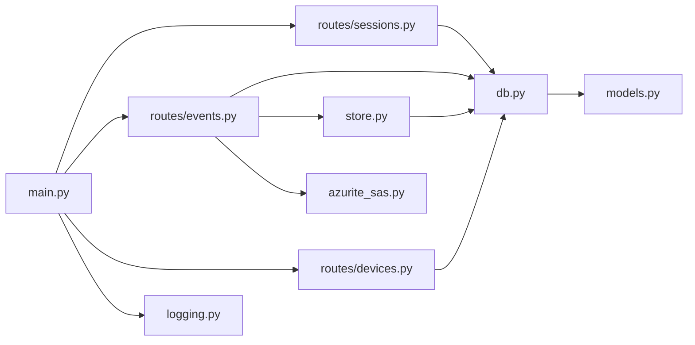
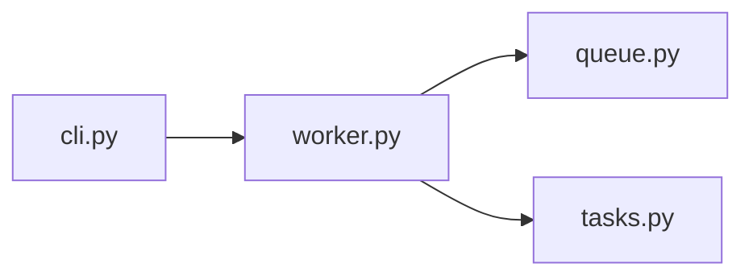

# Component Map

## Frontend Components

```mermaid
flowchart LR
  App[App.tsx]
  API[api.ts]
  Device[device.ts]
  Recorder[recorder.ts]
  Motion[motion.ts]
  Audio[audio.ts]
  Buffer[clipBuffer.ts]
  Asm[clipAssembler.ts]
  Store[clipStore.ts]
  Upload[clipUpload.ts]

  App --> API
  App --> Device
  App --> Recorder
  Recorder --> Motion
  Recorder --> Audio
  Recorder --> Buffer
  Buffer --> Asm
  Asm --> Store
  Store --> Upload
  Upload --> API
```

## Backend Components

```mermaid
flowchart LR
  Main[main.py]
  Sessions[routes/sessions.py]
  Events[routes/events.py]
  Devices[routes/devices.py]
  Models[models.py]
  DB[db.py]
  Store[store.py]
  SAS[azurite_sas.py]
  Log[logging.py]

  Main --> Sessions
  Main --> Events
  Main --> Devices
  Sessions --> DB
  Events --> DB
  Devices --> DB
  DB --> Models
  Store --> DB
  Events --> Store
  Events --> SAS
  Main --> Log
```

## Worker Components

```mermaid
flowchart LR
  CLI[cli.py]
  Worker[worker.py]
  Queue[queue.py]
  Tasks[tasks.py]

  CLI --> Worker
  Worker --> Queue
  Worker --> Tasks
```
