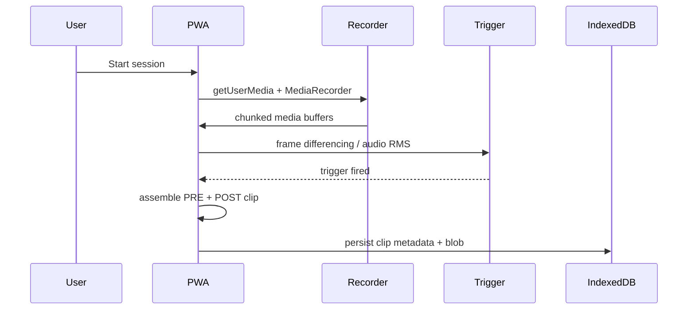
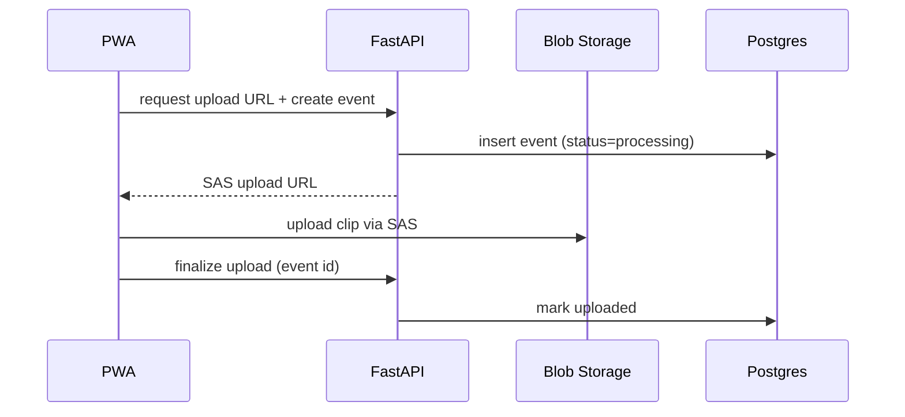
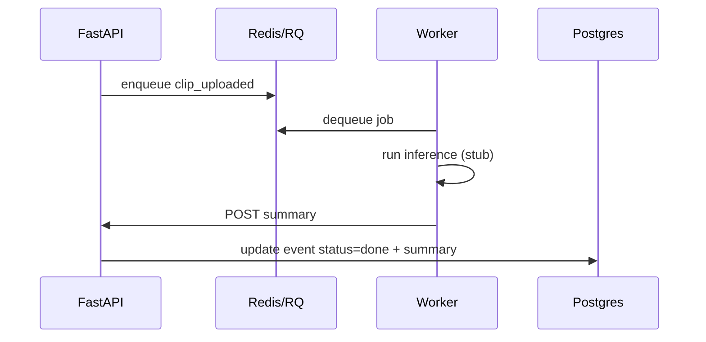
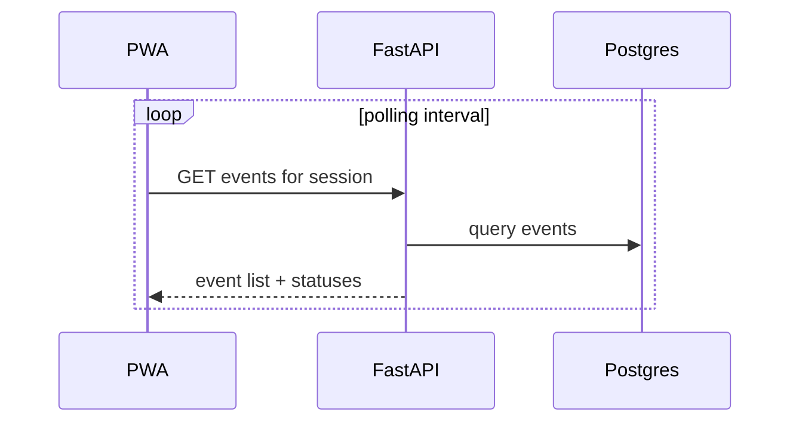

# Core Flows

## On-Device Capture + Trigger

## Upload + Event Sync

## Processing + Summary Update (Stubbed)

## Frontend Timeline Refresh

## Local Upload Fallback

If Azurite credentials are not configured, the backend writes uploads to
`backend/.local_uploads` (override via `LOCAL_UPLOAD_DIR`) and still records
events in Postgres.
